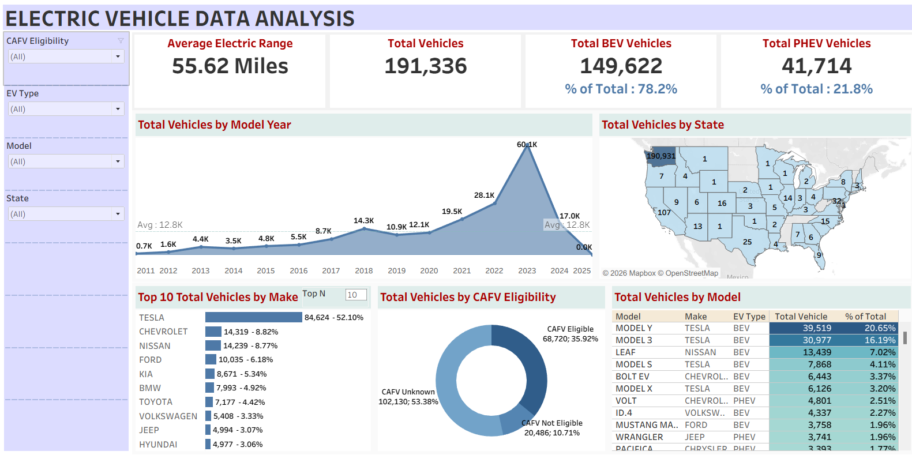

# Electric Vehicle Population Dashboard

Interactive Tableau dashboard analyzing electric vehicle registrations.

## Tools Used
Tableau, Excel

## Key Metrics
- Total vehicles: 191,336
- Battery electric (BEV): 149,622 (78.2%)
- Plug-in hybrid (PHEV): 41,714 (21.8%)
- Average electric range: 55.62 miles
- Tesla share of vehicles by make:84,624 (44%)

## What I Analyzed
- Vehicles by model year, state, make and model
- CAFV eligibility breakdown
- Filters for CAFV eligibility, EV type, model and state

## Dashboard Preview

## Key Findings

- 78.2% of vehicles are battery-electric and 21.8% are plug-in hybrids.
- Tesla Model Y (20.65%) and Model 3 (16.19%) are the most common models.
- Registrations by model year peak in 2023 at about 60.1K.
- Almost all records are in Washington state (190,931), so the data is not nationwide.
- 53% of vehicles have unknown CAFV eligibility, a data-quality gap.

Portfolio: https://thahliya-portfolio.lovable.app
